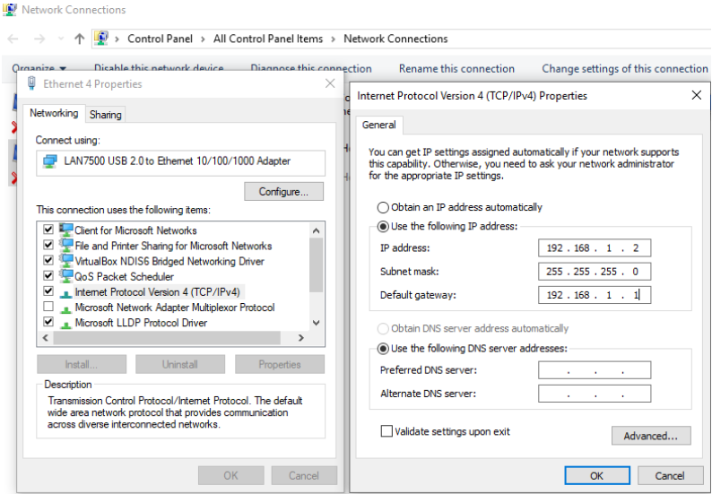
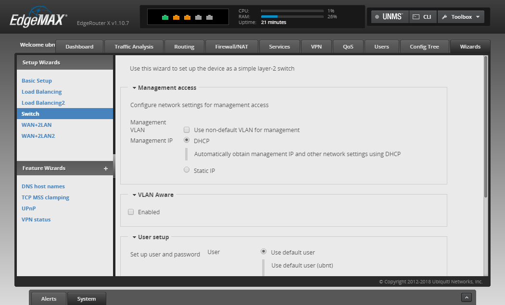
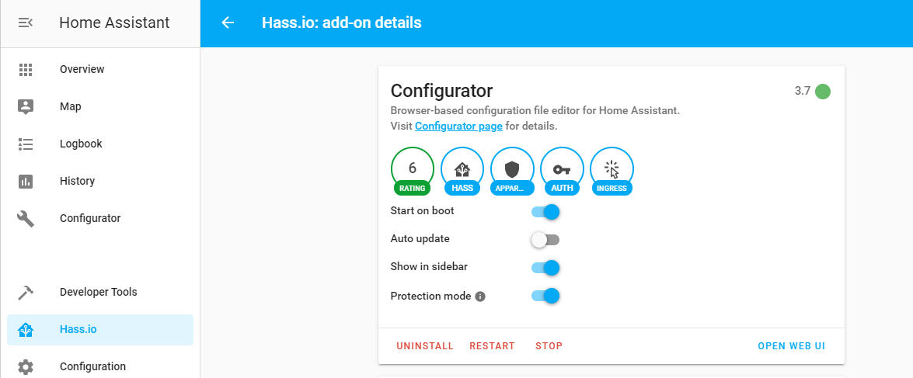
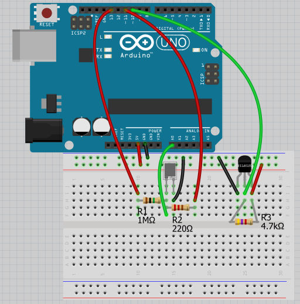

Home Automation Group2
======================

## 1. Introduction
---------------

Home Assistant is an open source home automation program, that claims to
put local control and privacy first. It is powered by a worldwide
community of DIY (do it yourself) hobbyists. Paired with a Raspberry Pi,
or perhaps a local server, it makes for a great home automation hub. An
automation hub is a smart appliance that can connect and link with other
smart devices and issue commands under the circumstances you've setup.
What makes home assistant great is that it is open source, it is free to
use and also guarantees privacy of the data collected by it, as you can
audit the code yourself. The second main point is that it supports many
different products, it is made to be flexible and easily integrated.
Hass.io is the operating system for home assistant.

https://www.home-assistant.io/\
https://www.home-assistant.io/hassio/

## 2. Project plan
---------------

Our initial plan was to develop Home Assistant as Docker image on
RaspberryPi and connect with IKEA Tradfri gateway connected with smart
devices such as IKEA Smart bulb, motion sensor, remote control. Since
HASS.IO have integrated with built-in weather service of hassio
(Meteorologisk institutt in this case) and able to log current weather
condition including the forecast report, we can keep this feature as our
main feature for home assistant weather service as long as the Raspberry
Pi has internet connection. After that, we can expand with an Arduino
UNO to log environment temperature and humidity as additional features
for light control automation.

## 3. Lab set up
-------------

### 3.1. Setup with associated Home Assistant VLAN network:

\- After factory reset, configure edge router as VLAN-aware switch to
connect to virtual LAN in the lab network through **port 2.5** (as
agreed):\
- Setting up local network to use static IP address, as an example:



\- Access to edge router at **192.168.1.1**, and login with default
credentials (username & password: ubnt). In the ***Setup Wizards***
panel, select *Switch* on the left menus. This window should appear:



\- Check the *"Use non-default VLAN for management"* and enter VLAN ID
value: **835**, then select Static IP for *"Management IP"* in order to
locate the switch after finishing configuration.\
- Enabled VLAN Aware check box and assign **835** into pvid box for the
tagged port (eth0) and vid box for the untagged client port (eth1 --
eth4). Finally, click Apply and Reboot the router. (The configuration
are saved as back-up in project's git repo).\
\*Example static ip config:\
\> Address: 172.27.35.10 / 24\
\> Gateway: 172.27.35.1\
\> DNS server: leave blank

### 3.2. Prepare Raspbian on Raspberry Pi 3/4 (or initialize VM on VirtualBox) for Hassio:

\- Select latest Raspbian with Desktop image from Raspberry Pi official
[site](https://www.raspberrypi.org/downloads/raspbian/) (Select
"Raspbian Lite" option, though Raspbian with Desktop is more versatile
choice, in this project, we don't need to use it )\
\| **Notice** : As of October 2019, HassIO has stopped supporting
Hassbian (and is deprecated), nevertheless, Hassbian users can continue
using it without seeing any visible issue. Therefore, it's advisable to
install Docker image of HassIO

### 3.3. Setup HASS.io as Docker image on Raspberry Pi (the same procedure can be applied on a Virtual Machine):

#### 3.3.1. Install Docker for Debian Buster (for raspberry pi 4)

\- From Terminal, enter the following command to install docker:\
``` bash
sudo curl -sL get.docker.com | sed 's/9)/10)/' | sh
```

#### 3.3.2. Install Hassio dependencies

``` bash
sudo apt-get install apparmor-utils apt-transport-https avahi-daemon ca-certificates curl dbus jq network-manager socat software-properties-common
```

#### 3.3.3. Install Hassio

\- Save Hassio installer file:
``` bash
curl -sL "https://raw.githubusercontent.com/home-assistant/hassio-installer/master/hassio_install.sh" >> hassio_install.sh
```

- Run install script: 
``` bash
sudo bash hassio_install.sh -m raspberrypi4
```
Click [here](https://community.home-assistant.io/t/rpi-4-installation/123514/87) for more details

## 4. Automation Configuration
---------------------------

### 4.1. Initialize HassIO:

\- Try to access the webUI from local desktop browser at port *8123* of
Raspberry Pi.

\- Enter a username and password for creating first user.\
(\*Optional: Accept location detection to get local weather data from
met.no)
- HassIO would start to process initialization for around 5 mins. After
that, this window should appear

### 4.2. Add IKEA devices

\- Connect IKEA Gateway with one client port on Edge router, also try to
detect its assigned IP address (with scanning tools such as Netscan or
Wireshark)

\- Go to Configuration \> Integrations \> Setup new integration then
select IKEA Tradfri enter Gateway IP addr (otherwise select the detected
device if it appear on the window); Use the Security code at the back of
the Gateway to activate.

- Install mobile app "Home Smart(TRADFRI)" on the smartphone in order to
establish connection with remote control, IKEA smart light bulb, and
motion sensor.

### 4.3. Install Configurator UI

\- In order to construct automations in HassIO, we can use the built-in
interface webUI (Configuration \> Automations), or install an extension
called "Configurator" , which can be found in Add-on Store (HassIO \>
ADD-ON STORE). WebUI interface is more user-friendly for beginners to
start with, whereas Configurator, which interacts with the
automation.yaml file in HassIO docker container, allowing user to easily
arrange and manage the configurations. In this project, Configurator is
the better choice since the arduino Serial communication can only be set
up with manual configuration scripts.



### 4.4. Configuration Details

#### 4.4.1. Configuration

\- Because of the fact that our plan was to implement the currently
deployed version of HomeAssistant to the extent that no impact would be
done to the backend of HassIO, we decided to only add extra integration
in the configuration.yaml instead of trying to modify the default
configuration setup

\- In order to improve the security within the emblab-homeassistant2
network, it is recommended to protect the communication between browser
and frontend with [SSL/TLS Self-signed certificate](https://www.home-assistant.io/docs/ecosystem/certificates/tls_self_signed_certificate/)

\- Setup DuckDNS account with email and install the server on raspberry
pi with the following [tutorial](https://www.duckdns.org/install.jsp).

- Include automation file with the following script:
```yaml
automation: !include automations.yaml
```

#### 4.4.2. Environment sensing with Arduino



\- We used digital thermometer sensor DS18S20 and Smartec Capacitive
Humidity sensor HS07.

\- Example codes for temperature sensing can be found from
[OneWire](https://www.pjrc.com/teensy/td_libs_OneWire.html) library.

\- Humidity is measured by using the following relation:
- Cc = Cs + S \*(Xrh -- 55) with:

-   Cc = measured capacitance(pF)
-   Cs = capacitance value at 55% RH (pF)
-   Xrh = measured Relative Humidity(%)
-   S = sensitivity (pF/%RH)

\- *Method to measure capacitance*:
- The capacitor HS07 will charge through a resistor in one time constant
defined as T seconds where:

-   TC = R \* C
-   TC = time constant period in seconds
-   R = resistance in ohms
-   C = capacitance in farads (1 microfarad (ufd) = .0000001 farad =
    10\^--6 farads)

\- The capacitor's voltage at one time constant is defined as 63.2% of
the charging voltage.

\- Communication with Arduino with Serial bus (USB port):\
- Run the following command to detect the USB port connected with
Arduino:
```bash
    ls /dev/tty*
```

- Find the one ends with "USBx" then copy the path for sensor connection
configuration scripts in `configuration.yaml`

```yaml
sensor:
  - platform: serial
    serial_port: /dev/ttyUSBx
    baudrate: 9600
  - platform: template
    sensors:
      temp:
        friendly_name: Celsius Temperature
        unit_of_measurement: "°C"
        value_template: "{{ states('sensor.serial_sensor').split(',')[0] | float}}"
      humidity:
        friendly_name: Humidity
        unit_of_measurement: "%"
        value_template: "{{ states('sensor.serial_sensor').split(',')[1] | float}}"
```

#### 4.4.3. Automation

\- Home Assistant offers a wide range of automation configurations.
There are three different parts in home automation rule: a trigger, a
condition and an action. Triggers describe events that would trigger the
automation rule. Conditions are optional tests that can limit an
automation rule to only work in your specific use cases. A condition
will test against the current state of the system. This includes the
current time, devices, people and local light condition such as sun
rise/ sun set. The action will be performed when a rule is triggered and
all conditions are met. Moreover, automation rules interact directly
with the internal state of Home Assistant.

Automation Examples: (Can also be done from the WebUI)

\- Turn light bulb on during sunset:

```yaml
- id: '1572854591783'
alias: Turn on light at sun set
description: ''
trigger:
- event: sunset
  offset: -0:30
  platform: sun
condition: []
action:
- data:
    entity_id: all
  service: light.turn_on
```
- In yaml code above, the light would be switched when event "sun-set"
occurs.

\- Change light color on diferent temperature:

```yaml
- id: '1578642959975'
  alias: Turn on warm light
  description: ''
  trigger:
  - above: 10
    below: 25
    entity_id: sensor.temp
    for: 00:00:05
    platform: numeric_state
  action:
  - data:
      color_temp: 400
      brightness: 130
      entity_id: light.tradfri_bulb
    service: light.turn_on
```

\- The automation trigger in this case is "sense.temp" numeric value (in
centigrade) when it falls below 25.

\- Color temperature (color\_temp) value corresponds to micro reciprocal degree ([mired](https://en.wikipedia.org/wiki/Mired)) scale (according to [light](https://www.home-assistant.io/integrations/light) configuration page).
